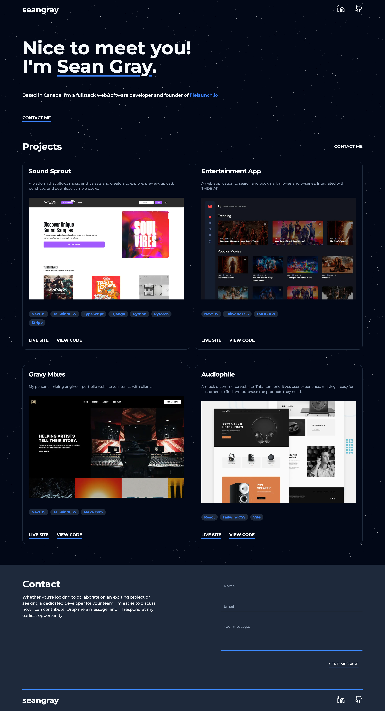

This is my portfolio website built with [Next.js](https://nextjs.org/) and bootstrapped with [`create-next-app`](https://github.com/vercel/next.js/tree/canary/packages/create-next-app). This project also utilizes [Tailwind CSS](https://tailwindcss.com/) for styling and [shadcn]('https://ui.shadcn.com/') as a component library. Form submissions are handled by [Formspark](https://formspark.io/).

The [Live Site](https://seangray.tech) is hosted on [Vercel](https://vercel.com/).

## Preview

